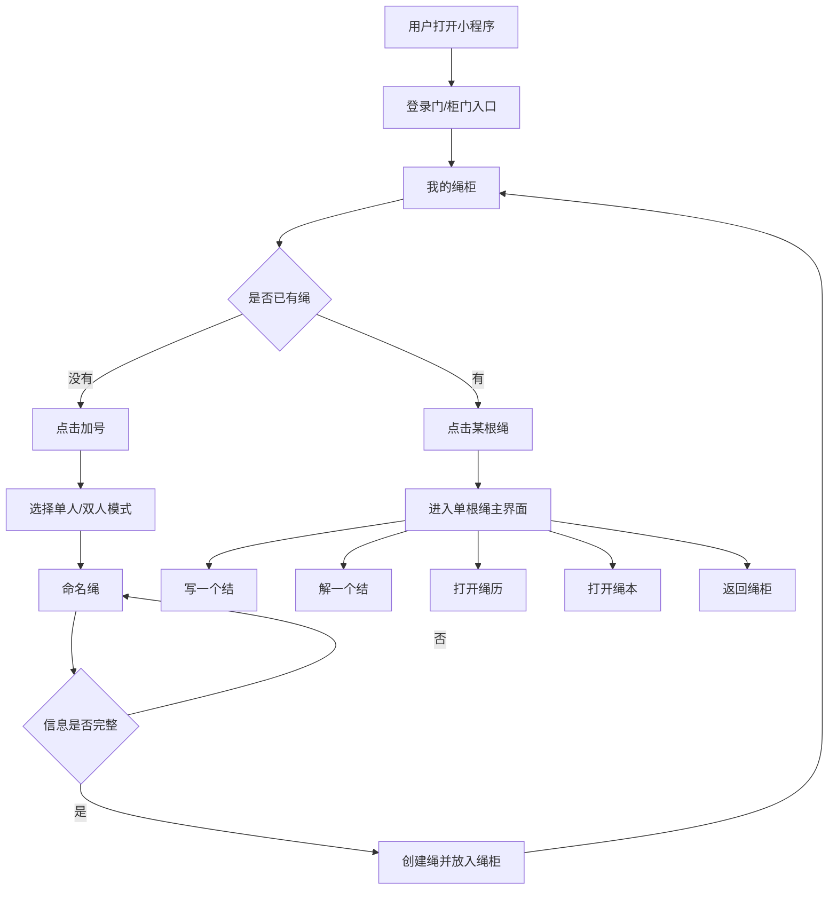
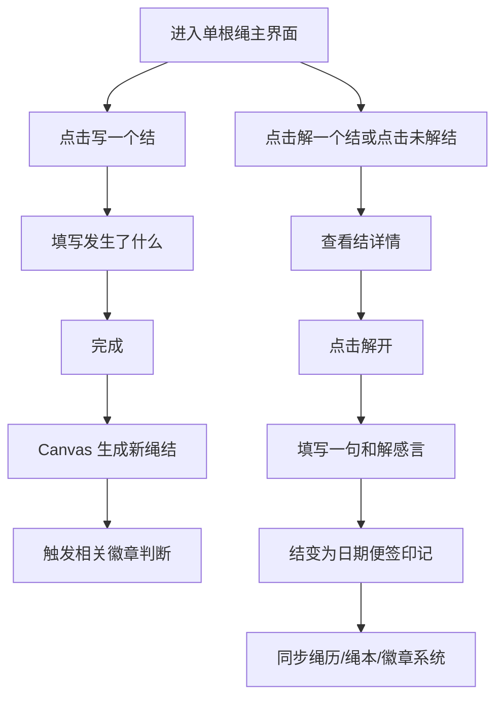
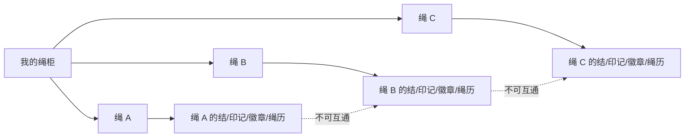

# 绳话 PRD

版本：v0.1  
日期：2026-07-03  
产品形态：微信原生小程序 + Canvas 2D + 微信云开发  
当前阶段：浏览器静态预览原型 + 小程序 MVP 骨架

## 1. 产品背景

亲密关系中的矛盾、和解、纪念日往往分散在聊天记录、相册、备忘录里，缺少一个低压力、可回看的共同记录空间。传统情侣 App 常把关系经营做成打卡、任务或强提醒，容易让用户产生负担。

「绳话」把一段关系想象成一根被两个人共同保存的绳子：

- 发生矛盾时，不用分类、不用评价，只把这件事“系成一个结”。
- 和好后，结不会被删除，而是变成带日期的印记，留下“我们处理过它”的痕迹。
- 特殊节点由系统自动生成旧章、徽章或挂饰，像手账本里自然出现的小纪念。

产品核心不是监督情侣，而是把关系里的小裂缝、小修补和小庆祝，变成可被温柔保存的视觉记忆。

## 2. 产品目标

### 2.1 用户目标

- 快速记录矛盾：三步内完成，不增加表达负担。
- 共同完成和解：双方都确认后，结才转为印记。
- 回看关系轨迹：能从时间轴、绳本、绳子视觉上回看过去。
- 保留仪式感：用手账、旧纸、绳结、徽章等视觉语言降低冷冰冰的数据感。
- 支持多根绳：用户可以为不同关系、主题或阶段创建独立的绳，互不混淆。

### 2.2 产品目标

- 建立鲜明视觉记忆点：垂挂绳子、木柜、手账纸、旧章徽章。
- 降低记录门槛：不做复杂类别、紧度、心情量表。
- 建立长期留存理由：绳历、绳本、徽章系统和特殊节点自动回馈。
- 为微信云开发落地准备清晰的数据结构和业务流程。

### 2.3 MVP 目标

- 完成登录门、我的绳柜、添加绳、进入单根绳、写结、解结、绳历、绳本、设置重置。
- 使用 Canvas 2D 绘制单根绳时间线。
- 使用本地缓存作为浏览器预览降级，后续切换到微信云开发。
- 自动生成基础徽章，并与绳历、绳本同步。

## 3. 目标用户群体

### 3.1 核心用户

正在恋爱或稳定亲密关系中的年轻用户，尤其是喜欢手账、记录、仪式感的人。

典型特征：

- 愿意记录关系中的情绪和事件。
- 不喜欢严肃心理工具或过重的关系管理感。
- 喜欢“旧纸、便签、徽章、手绘”这一类低饱和视觉。
- 希望争吵后有一个柔和的和解入口。

### 3.2 次级用户

- 异地情侣：需要共同记录、共同确认和解。
- 新婚或长期伴侣：希望记录矛盾如何被处理、关系如何变稳定。
- 朋友/亲密搭子：可把“情侣关系”抽象成一段共同关系绳。

### 3.3 非目标用户

- 需要专业心理咨询或冲突干预的用户。
- 希望用产品监督、评判、打分对方的用户。
- 只需要日历提醒或纪念日工具的用户。

## 4. 核心概念

| 概念 | 说明 |
| --- | --- |
| 绳 | 一段关系或一个记录主题的容器。不同绳之间数据隔离。 |
| 结 | 未解决的矛盾或没说完的话。 |
| 印记 | 已解开的结，保留日期与和解感言。 |
| 徽章/挂饰 | 系统根据特殊节点自动生成的纪念物。 |
| 绳柜 | 首页管理多根绳的入口，像旧木柜收纳每一根绳。 |
| 绳历 | 单根绳的时间轴，展示结、印记、徽章的日期记录。 |
| 绳本 | 单根绳的记事本，集中查看写过和解开的内容。 |

## 5. 业务流程图

### 5.1 总体流程



### 5.2 打结与解结流程



### 5.3 多绳数据隔离流程



## 6. 功能模块

### 6.1 登录门模块

目标：形成第一次进入产品的仪式感。

功能要求：

- 展示木柜门视觉，门上刻有「绳记」或当前品牌名。
- 柜门把手区域可点击，并带高亮提示。
- 点击后进入「我的绳柜」。
- 后续微信版可在此处接入静默登录、openid 获取和云端身份初始化。

### 6.2 我的绳柜模块

目标：管理多根绳，并作为用户的主首页。

功能要求：

- 初始状态没有绳。
- 点击底部中间加号进入添加绳界面。
- 每创建一根绳，木柜对应收纳格中出现一根代码绘制的绳。
- 每根绳有独立便签，显示绳名、未解数量、已解数量。
- 点击绳子直接进入该绳主界面。
- 设置和搜索按钮与加号处于同一底部工具栏。
- 绳子超过当前可见区域时，柜体内部可滚动。

### 6.3 添加绳模块

目标：替代旧命名弹窗，提供更完整的创建流程。

功能要求：

- 点击首页加号进入独立添加页面。
- 页面左侧提供返回按钮。
- 用户选择绳结模式：
  - 单人：适合个人记录关系事件。
  - 双人：适合双方共同参与的关系记录。
- 模式图使用透明贴图，直接贴在牛皮纸背景上。
- 模式名称放在图片正下方。
- 用户输入绳名。
- 只有同时选择模式并填写绳名后，创建按钮才可用。
- 创建后返回绳柜，新绳出现在柜子中。

### 6.4 单根绳主界面

目标：承载关系时间线。

功能要求：

- Canvas 2D 绘制一根垂直手绘绳。
- 顶部显示相伴天数、未解数量、已解数量。
- 页面打开时默认定位到最新记录附近。
- 底部提供：
  - 写一个结
  - 解一个结
  - 翻绳本
  - 记绳
- 侧边提供：
  - 返回
  - 绳历
- 绳上元素按照创建时间从上到下排序：
  - 未解结
  - 已解印记
  - 徽章/挂饰

### 6.5 写一个结

目标：让用户快速记录矛盾或没说完的话。

功能要求：

- 从「写一个结」入口进入，不允许点击空白绳子误触发。
- 输入框为便签纸样式。
- 用户只需要输入一段话，不需要选择分类、强度或标签。
- 保存后在绳子最新位置生成一个结。
- 新结生成有手工出现的动效。
- 触发徽章系统判断，例如第一次打结。

### 6.6 解一个结

目标：把未解决事件转为已处理印记。

功能要求：

- 用户点击未解结可查看详情。
- 点击「解开」后填写一句和解感言。
- 解开后状态变为已解。
- 绳子对应位置显示便签纸式印记，便签上展示日期。
- 详情页展示：
  - 哪天结下
  - 哪天解开
  - 原内容
  - 和解感言
- 解结后同步绳历、绳本和徽章系统。

### 6.7 绳历模块

目标：提供可选中日期的时间轴。

功能要求：

- 从单根绳主界面右侧入口打开。
- 列出该绳的结、印记、徽章。
- 点击某条日期记录时，绳上对应元素用红色手绘线圈高亮。
- 再次点击同一日期取消选中。
- 仅打开绳历时显示高亮，主界面普通浏览不显示红圈。
- 底部最新记录也必须可选中，不应直接跳过选中逻辑打开详情。

### 6.8 绳本模块

目标：集中查看记录内容。

功能要求：

- 展示已写过和已解开的记录。
- 已解结可以继续查看。
- 搜索只搜索用户写下的内容和解开的信息，不搜索徽章文案。
- 徽章系统同步展示在绳本中，但不干扰搜索结果。

### 6.9 徽章系统

目标：形成自动奖励和纪念机制。

功能要求：

- 用户零操作，系统自动判断并生成。
- 初期使用阶段的“第一次”要有徽章。
- 打卡型徽章与解结型徽章使用不同 UI。
- 徽章在绳子上必须像挂上去，而不是悬浮。
- 徽章不展示拥挤文字，使用旧章/图案/颜色区分。
- 一页可见范围内尽量避免重复颜色和图案。
- 徽章挂绳颜色可随徽章主色变化。

触发示例：

- 第 1 天、第 2 天、第 3 天、第 7 天
- 第一次打结
- 第一次解结
- 解结 10 次
- 和平 30 天
- 相伴 100 天

### 6.10 搜索模块

目标：支持跨绳查找记录。

功能要求：

- 首页搜索为全局搜索，搜索所有绳中的记录。
- 搜索抽屉出现时，主页柜子位置不能偏移。
- 搜索结果只包含用户记录或解开内容。
- 点击搜索结果进入对应绳和对应记录。

### 6.11 设置模块

目标：提供基础管理能力。

功能要求：

- 设置入口位于首页底部工具栏左侧。
- 设置抽屉可点击空白处关闭，也可点击关闭按钮。
- 重置功能放在设置里。
- 重置前必须二次确认。
- 重置后清空所有绳、结、印记、徽章和选中状态。

## 7. 页面原型图

以下为文字版低保真原型，实际视觉以手账本、旧木柜、牛皮纸和手绘绳为准。

### 7.1 登录门

```text
┌──────────────────────────┐
│                          │
│        木质柜门背景        │
│                          │
│     ┌──────┐ ┌──────┐     │
│     │  绳  │ │  记  │     │
│     └──────┘ └──────┘     │
│                          │
│          ◖ 高亮把手 ◗      │  点击进入
│                          │
└──────────────────────────┘
```

### 7.2 我的绳柜

```text
┌──────────────────────────┐
│          木质牌匾          │
│            我的绳          │
│ ┌──────────────────────┐ │
│ │   绳1        绳2      │ │
│ │ [便签]     [便签]     │ │
│ ├──────────────────────┤ │
│ │   绳3        绳4      │ │
│ │ [便签]     [便签]     │ │
│ ├──────────────────────┤ │
│ │   可继续下滑查看更多   │ │
│ └──────────────────────┘ │
│       [设置] [＋] [搜索]  │
└──────────────────────────┘
```

### 7.3 添加绳

```text
┌──────────────────────────┐
│ [返回]                    │
│      ┌────────────────┐   │
│      │ 选择你的绳结模式 │   │
│      └────────────────┘   │
│                            │
│    透明贴图        透明贴图 │
│     单人            双人    │
│                            │
│      ┌────────────────┐   │
│      │ 命名你的绳结     │   │
│      │ ＿＿＿＿＿＿＿    │   │
│      └────────────────┘   │
│             麻绳           │
│             麻绳           │
│            [创建]          │
└──────────────────────────┘
```

### 7.4 单根绳主界面

```text
┌──────────────────────────┐
│  0天相伴    0未解   0已解 │
│                          │
│ [返回]              [绳历]│
│                          │
│             │            │
│             │            │
│             ● 未解结      │
│             │            │
│          [日期便签] 已解   │
│             │            │
│         旧章/徽章挂饰      │
│             │            │
│                          │
│ [写一个结] [解一个结]      │
│ [翻绳本]                  │
│           [记绳]          │
└──────────────────────────┘
```

### 7.5 绳历抽屉

```text
┌──────────────────────────┐
│             绳子主画面     │
│        被选记录红圈高亮     │
│                     ┌────┐│
│                     │绳历││
│                     │ ×  ││
│                     │6/29││
│                     │6/30││
│                     │7/01││
│                     └────┘│
└──────────────────────────┘
```

### 7.6 绳本弹窗

```text
┌──────────────────────────┐
│        纸质弹窗：绳本       │
│  ┌──────────────┐ [搜索]   │
│  │ 已解：6/29    │          │
│  │ 原内容摘要     │          │
│  ├──────────────┤          │
│  │ 未解：7/02    │          │
│  │ 原内容摘要     │          │
│  └──────────────┘          │
│              [收好]        │
└──────────────────────────┘
```

## 8. 数据结构草案

### 8.1 ropes

```js
{
  ropeId: 'rope-xxx',
  name: '电影绳',
  mode: 'single' | 'couple',
  members: ['openid-a', 'openid-b'],
  relationshipStartedAt: Date,
  createdAt: Date,
  updatedAt: Date
}
```

### 8.2 rope_events

```js
{
  eventId: 'event-xxx',
  ropeId: 'rope-xxx',
  type: 'knot' | 'badge',
  status: 'open' | 'resolved',
  content: '发生了什么',
  anchorY: 260,
  createdBy: 'openid-a',
  createdAt: Date,
  resolvedAt: Date,
  resolutionLine: '和解感言',
  badgeMeta: {
    badgeId: 'first-knot',
    family: 'checkin' | 'repair',
    tone: 'brass',
    motif: 'star'
  }
}
```

## 9. 非功能需求

### 9.1 视觉要求

- 整体为手账本风格。
- 背景使用牛皮纸、粗糙纸纹、低饱和旧纸色。
- 绳子必须手绘感，不要完美矢量线。
- 木柜有真实木纹、阴影、隔板和收纳空间。
- 弹窗、便签、按钮保持统一纸质/旧物质感。

### 9.2 交互要求

- 主要操作不超过 3 步。
- 首页点击绳子直接进入该绳，不再使用复杂拉绳动画。
- 抽屉类组件支持点击空白关闭。
- 可误触风险高的操作必须放入明确入口，例如写结必须从「写一个结」进入。

### 9.3 性能要求

- GitHub Pages 静态版本首屏资源应尽量压缩。
- 大图优先 WebP。
- Canvas 绘制避免无意义持续重绘。
- 手机端避免布局偏移，按钮必须在同一水平线或明确对齐。

### 9.4 隐私要求

- 每根绳数据隔离。
- 未经用户确认，不向其他绳或其他用户暴露记录。
- 双人模式下，后续需要明确邀请、加入和权限机制。

## 10. 版本规划

### MVP

- 登录门
- 我的绳柜
- 添加绳
- 单根绳主界面
- 写结/解结
- 绳历
- 绳本
- 设置重置
- 本地缓存与基础云开发结构

### V2

- 微信云开发完整联调
- 双人邀请与确认机制
- 更细分徽章系统
- 关键词提取
- 词云
- 更完整的全局搜索结果跳转

### V3

- 多端同步
- 分享卡片
- 纪念日自动生成图
- 更丰富的绳柜主题和手账纸张
- 数据导出与回忆册

## 11. 验收标准

- 用户首次打开能理解“从柜门进入我的绳”。
- 空柜子状态下，用户能通过加号创建第一根绳。
- 添加绳页面不出现白底素材块，模式图像贴图一样融入背景。
- 创建后的绳出现在柜子里，点击可进入独立主界面。
- 写结、解结、绳历、绳本的数据只属于当前绳。
- 重置后柜子为空，不保留旧痕迹。
- GitHub Pages 静态预览可在手机浏览器访问。
